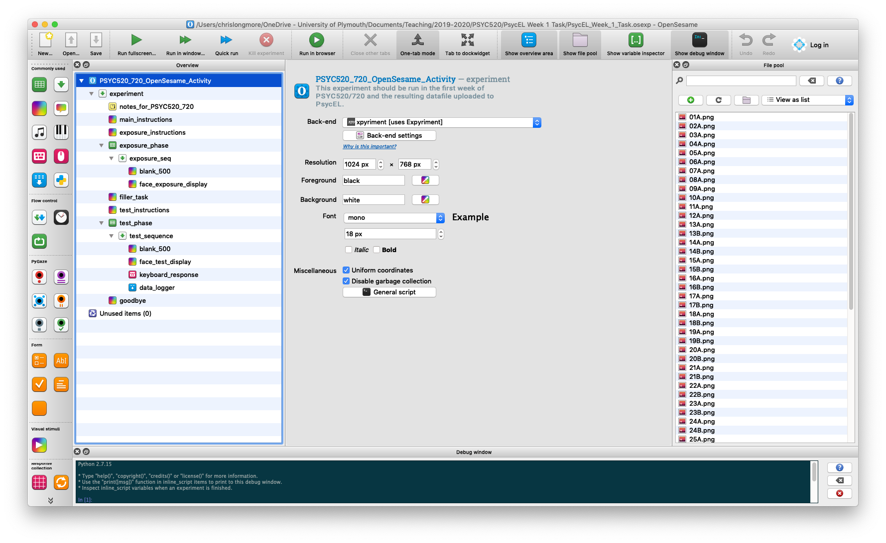

# Running An Experiment In OpenSesame

_Chris Longmore_

## Introduction

OpenSesame is a computer software package for running psychology experiments. It is a free program that is available for computers running Windows and macOS and it is the program you will be using in PSYC520/720 to run your experiments. The purpose of the exercise here is to get OpenSesame installed on your own computer, run through a sample experiment and upload a datafile to Psyc:EL.

## Installing OpenSesame

OpenSesame can be downloaded via the following links:

- If you have a Windows machine, click [here](https://github.com/open-cogsci/OpenSesame/releases/download/release%2F3.3.6/opensesame_3.3.6-py37-win64-2.exe)
- If you have an Apple Mac, click [here](https://github.com/open-cogsci/OpenSesame/releases/download/release%2F3.3.6/opensesame_3.3.6-py37-macos-3.dmg)

### Windows Machines

Once downloaded, you will need to double-click on the installer icon to install the program. You will likely find the installer in your downloads folder. Leave all options on their defaults and keep clicking *next* in the installer. It will take a while to install (there are lots of files) so give it some time. After installation, OpenSesame should be available in the programs menu. You will see two programs available to you - OpenSesame and OpenSesame (runtime). Throughout PSYC520/720, *always* use OpenSesame. Click on the program to start. Note that it may take some time to load the first time you run OpenSesame.

A full video showing the process:

<video width="960" height="540" controls>
<source src = "https://www.psy.plymouth.ac.uk/LabPlus/PSYC520/installing_on_windows.mp4" type = "video/mp4">
</video>

### Apple Macs

The downloaded file is a Disk Image file. Once the file has downloaded (you will probably find it in the Downloads folder) and you have opened the file, you will see the OpenSesame icon and an alias to your Applications folder. Drag the OpenSesame icon over to the Applications folder. It will then install. You will then be able to find OpenSesame in your Applications folder. Note: do not run OpenSesame from the disk image.

Depending upon your version of macOS, and the security settings you have enabled, there might be a couple of extra steps. Try to run OpenSesame. If your computer says it cannot as it is from an unidentified developer, instead of double-clicking on the OpenSesame icon, right click once and select **Open**. The warning will now give you the chance to open the application so click **Open** to run the program. There are other possibile access rights messages that pop up. If you see one of these, there will be two optoins; to open system preferences and deny. Click on open system preferences and grant any instance of OpenSesame access.

A full video showing the process:

<video width="960" height="540" controls>
<source src = "https://www.psy.plymouth.ac.uk/LabPlus/PSYC520/Installing_on_macos.mp4" type = "video/mp4">
</video>

## The Interface

We will be covering the interface in detail in Week 3 when we look at building an OpenSesame experiment. For now, all we want to do is change one setting to make the interface a little less cryptic. You will notice that the toolbar is a little nondescript and looks like this:

We can make it more readable by enabling an option that puts labels under each button so we know what each button does. On Windows, click on the Tools menu and select Preferences. For Macs, click on the OpenSesame menu and then select Preferences. For both computer types the page that comes up is the same. Look for an option near the top that says **Show text in toolbar**. Check the box next to this text and suddenly all the menubar items should now have a label like this:

The good news is once you have done this the setting sticks so you will not have to do this every time.

## Running An Experiment

The purpose of this exercise is to get used to running an OpenSesame experiment, so the precise details of the experiment itself are of less importance. To give a brief background however, the experiment you will be running is one you may well remember from PSYC412. In PSYC412 there was a PsycEL task in which you saw some faces that you were asked to remember. You then completed a few games of *Play your cards right* before being shown some more faces to which you needed to indicate whether you recognised the face or not. The OpenSesame version for PSYC520/720 is the same except for the filler task. Instead of playing a game you will be asked to count backwards, in threes, from 30 to 0. 

To begin, download the experiment from [here](openseslib/psycel_week_1_task.osexp). 

The experiment has probably been downloaded to your Downloads folder. To make life simple, move the file to your Desktop. Now go back to OpenSesame (or reopen it if you closed it earlier) and click on the **Open...** button in the toolbar. Now find your way to the Desktop and select the experiment file (called psyc520720_psychel_week1_task.osexp) then click Open. Once loaded it should look like this:

Do not worry about what it all means at this point! Instead, just click on the big green triangle in the toolbar called **Run fullscreen...**. OpenSesame will ask you to enter a subject number. Enter any numerical value you want here and click OK. You will then see a file selection box with the option to Save. OpenSesame is not very clear about what this is but this box is asking you where do you want to save the data file to and what should it be called. You will notice that the filename is pre-filled with the name subject-X where X is the subject number you gave in the previous step. The next piece of information is **very important**.

**By default, the directory where the data file will be saved is the same as where you opened the experiment from. So, if your experiment is on the Desktop (as suggested), and you do not change anything in this box, then the data file will also be written to the desktop. This is important to help you find your data file(s) after running the experiment. We recommend always letting OpenSesame write the data file to the same location that the experiment is located.** 

Click on Save and the experiment will begin. Read the instructions and work your way through the experiment. At the end of the experiment you will receive a thank you message. Press any key to close the experiment and return to OpenSesame. At this point you can close OpenSesame - you are done with it for this task.

## The Data File

Remember the text in bold above! The data file will be where you asked OpenSesame to save it and if you used the default location it will be placed in the same place as the OpenSesame script. So, if you copied the experiment file to the Desktop, look on the Desktop and you should find your data file. It is a CSV file - the kind you have been working with before and it will be called subject-X.csv where X is the number you gave to OpenSesame.

You can double-click on this file and it will load into your default spreadsheet program (most likely Excel). If you do this you might be a little shocked by what you see. Do not worry about this! All will be explained in the coming weeks! For now, all you need to do is upload this CSV file to the relevant PsycEL activity (called Using OpenSesame) and this task is done.

## Extra Information For The Interested

If you would like to learn more about OpenSesame you can find the full documentation [here](http://osdoc.cogsci.nl/). You do not have to look at this documentation, but the link is given for those who want to find out more.
