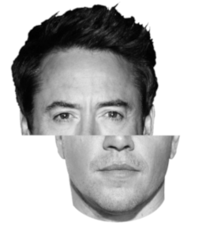

# Face Processing

## Overview

These [slides](topic3.odp) introduce the topic and a video presentation can be viewed by follwoing [this link](https://liveplymouthac-my.sharepoint.com/:v:/g/personal/chris_longmore_plymouth_ac_uk/EWQ9LJ9ZBXZMvBE3JoRU16oB55zWy1cBLgi0Nn4dmZ7r4w?e=eB5B9G)

## Sub-topic 1: Holistic processing of faces and the composite face effect

### Overview

Holistic processing refers to one way in which faces are perceived and processed. It refers to the processing of all aspects of the face (e.g. features, spatial relations between features and so on) as a single representation. One way of investigating holistic processing of faces is through the use of the compoiste face effect. A composite face is one in which the top half of individual's face has been paired with the bottom half of another person's face. An example is shown below. Can you identify the top half of the face? What about the bottom half?

People tend to find this task difficult because the two halves of the face are fused together to create a new, holistic, representation of a face. However this representation does not match any face you know, you find the task harder. Constrast this with the image below in which the two halves are misaligned.

In this image the two halves have been separated and the task becomes notably easier. This is because the two halves are no longer fused into a single holistic representation. You are then able to process the two halves with relative ease. (If you are still stuck [click here](holistic_ans.md) to find out who these people are). The term **composite face effect** refers to the difficulty people have with processing an *aligned* composite face as opposed to the relative ease in which they process a *misaligned* composite face.

This example demonstrates the composite face effect can influence the recognition of identity. Here are some papers that have looked at other aspects of face processing that are influenced by the composite face effect. **Make sure that you can clearly identify the effect of interest in the results section** (e.g. reports will be about the composite or alignment effect). A good paper will always be clear over tha analysis and what effects were analysed. Look out for this near the beginning of an analysis.

### Resources

Hole, G.J. (1994). Configurational factors in the perception of unfamiliar faces. *Perception*, *23*, 65 - 74, [DOI:10.1068/p230065](http://sro.sussex.ac.uk/id/eprint/14457/1/p230065.pdf)  
**This paper uses the term 'chimeric' instead of composite to refer to the effect. Here the two terms mean the same thing. Experiment 1 is the most similar to many composite face experiments**

Hugenberg, K. & Corneille, O. (2009). Holistic processing is tuned for in-group faces. *Cognitive Science*, *33*, 1173 - 1181 [DOI:10.1111/j.1551-6709.2009.01048.x](https://onlinelibrary.wiley.com/doi/full/10.1111/j.1551-6709.2009.01048.x)

Zhao, M. & Hayward, W.G. (2010). Holistic processing underlies gender judgements of faces. *Attention, Perception and Psychophysics*, *72*, 591 - 596 [DOI:10.3758/APP.72.3.591](https://link.springer.com/content/pdf/10.3758%2FAPP.72.3.591.pdf)  
**It is experiment 3 here that is of major interest as this one looks at the composite face effect**

## Sub-topic 2: Image-dependency of unfamiliar face recognition and matching

### Overview

As you may have learned in a previous module, unfamiliar face recognition is largely mediated by pictorial codes - cues to an identity that are tied to particular images (current students at Plymouth University can view [view the lecture here](https://plymouth.cloud.panopto.eu/Panopto/Pages/Viewer.aspx?id=f1cbe922-6246-4c99-84ee-a98801069f53)). This means that if you look at a single image of an unfamiliar face, you are quite likely to recognise **that particular image** of a the face again. However, change the image in some way, and recognition accuracy is likely to fall. Even when memory is not involved and a matching task is used, matching performance is degraded if you are asked to match two different pictures of a person's face (it is trivial if the same picture is used twice). The three papers below document ways in which unfamiliar face recognition is affected by images changes. Can you think of other ways in which recognition or matching might be affected?

### Resources

Balas, B., Gable, J. & Pearson, H. (2019). The effects of blur and inversion on the recognition of ambient face images. *Perception*, *48*, 58 - 71 [DOI:10.1177/0301006618812581](https://psyarxiv.com/dqjsy/)  
**Experiment 1 is the important one here. Note that this study used physical card sorting which will not be possible in OpenSesame. The key point is the effect that blurring has on a participant's ability to detect identity. Think about how such an effect might be looked at using a different paradigm that can be implemented in OpenSesame.**

Bindemann, M., Attard, J., Leach, A. & Johnston, R.A. (2013). The effect of image pixelation on unfamiliar face matching. *Applied Cognitive Psychology*, *27*, 707 - 717 [DOI:10.1002/acp.2970](https://kar.kent.ac.uk/36097/1/Bindemann_ACP_2013b.pdf)  
**Experiment 1 is the important one although aspects of Experiment 2 speak to the topic.**

Estudillo, A.J. & Bindemann, M. (2014). Generalization across view in face memory and face matching. *i-Perception*, *5*, 589 - 601. [DOI:10.1068/i0669](https://kar.kent.ac.uk/45624/1/Bindemann_iPerception_2014.pdf)  
**This paper looks at the effect of showing people different viewpoints of unfamiliar faces. It is interesting because it reports the results of both a matching experiment, and a recognition memory experiment (make sure you can identify the primary effect of interest in both cases!). You should only use one of these paradigms for your own experiment.**
